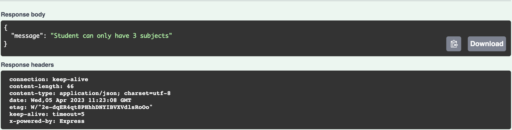

# How to run it?

1. Clone the repository
2. Run command `npm i` or `yarn add`
3. Create `.env` file in your root and make your port `PORT=<your port>`
4. In `./src/config/config.js` setting your database

change `username` to your DB username
 
change`password` to your DB password
 
name your DB in `database`

5. Run command `npm run db:sync` or `yarn run db:sync` to create, migrate and seed your database
6. Run command `npm run dev` or `yarn run dev` to running the application
7. In your browser go to routes `/api-docs` to see the swagger documentation

## Example

See all the subjects

 
 
See all students

 
 
Create a student with 3 subjects

 Output

 
 
Create a student with 4 subjects

 Output

 
 
Create with the same email

 Output

 
 
Input with subject that already has 4 students

 
Output

 
 
